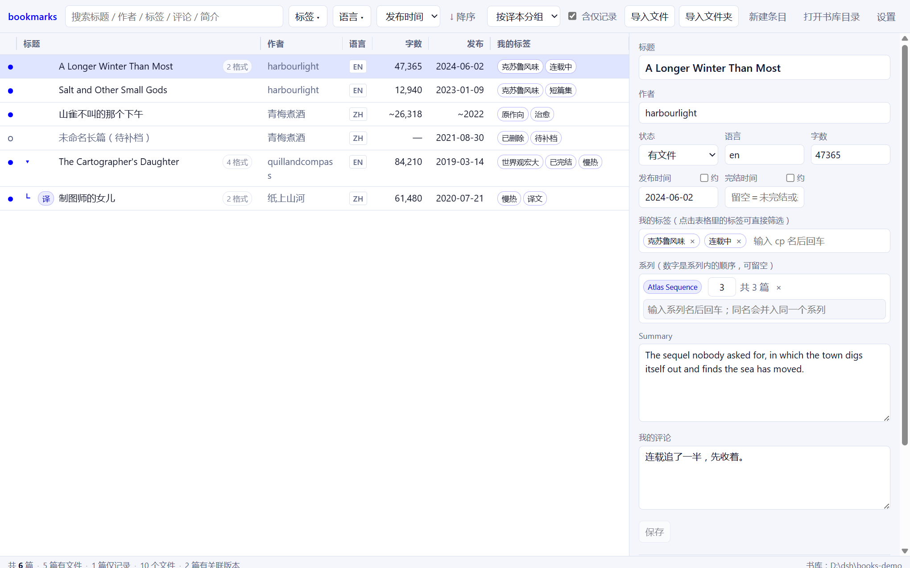

# bookmarks


A local, offline replacement for an AO3 bookmarks page. It keeps a personal library of
fanfiction on your own disk, so a work that gets hidden or deleted on AO3 is still there.

**English** | [中文](README.zh-CN.md)



## What it does

**Import and group.** Bring in PDF, HTML, EPUB, TXT and anything else. Several files of
the same work become one entry, so a story you have as HTML, EPUB and PDF shows up once
with a `3 格式` badge rather than three times.

**Pair translations automatically.** AO3 says which works are translations of which, so an
original and its translation are linked with no manual step — even if you import them
months apart. They stay adjacent in the list, and the translation sits under its original.

**Keep several versions.** A serialised work gets updated, or a finished one is revised and
reposted. Both copies are kept, one marked current, and you can switch back or delete
either. Identical content is never stored twice.

**Find things.** Search across title, author, your own tags, AO3's tags, your notes and the
summary. Punctuation and case are folded, so `一二三` finds `一，二，三`. Filter by tag or
language, sort by date, word count or title, and group by translation, series or nothing.

**Track the details.** Title, author, summary, publish and completion dates, word count and
language — plus your own comment and tags. Dates accept `2019`, `2019-06` or `2019-06-09`
and remember how precise you were. Anything you guessed is marked with `~`, so an estimate
never passes for a fact, and a number you type in yourself is never overwritten by a later
import.

**Keep a series.** A work can belong to a series, with a position; series and translation
links are tracked separately, because a series can contain translations.

**Record works you never downloaded.** If a work is already gone, add it by hand with the
title, author and whatever you remember.

## Where your library lives

Everything is on your disk: a SQLite database plus a `library/` folder holding the actual
files. Nothing is uploaded anywhere and there is no account.

Settings live in `%APPDATA%\com.bookmarks.app\settings.json`. The library itself defaults
to `%USERPROFILE%\Documents\bookmarks` and can be put anywhere from the settings panel — on
a different drive, for instance, if the system one is nearly full. Moving it is a copy →
verify → swap → delete, so an interrupted move leaves your library where it was.

To back it up, copy that one folder. The toolbar has a button that opens it.

## Installing

Download `bookmarks_0.1.0_x64-setup.exe` (installer) or the `.msi` from
[Releases](../../releases). The build is unsigned, so Windows SmartScreen will warn on
first run — choose "More info" → "Run anyway".

## Building from source

Needs Node, a Rust toolchain, and the WebView2 runtime (already present on Windows 11).

```
npm install
npm run app:dev          # development: hot reload
npm run app:build        # release: .exe + installers
```

`cargo test` runs the Rust suite; `npm run typecheck` checks the interface.

## Notes and limitations

- **The whole library is read into memory** on load. That keeps filtering and sorting
  instant, and is the right trade at this scale, but it is not built for tens of thousands
  of works.
- **EPUB and PDF text is not extracted**, so those files contribute no searchable text and
  their word count has to be typed in. For PDFs this is deliberate: the scanned ones would
  need OCR to be worth anything.
- **Grouping is evidence-based.** AO3 work ids come first, then filename-to-title matching.
  A file that matches nothing becomes its own entry rather than being merged on a guess — a
  wrong merge damages an existing record, an extra entry costs one click.
- **No CSV import yet**, so the AO3 bookmarks export is not read directly.
- The interface is bilingual (Chinese and English) but the app itself is not translated.

## Screenshots

The screenshot above is generated from a library of invented works, not a real collection:
`cargo run --example demo_library -- --library <dir>` builds it, and
`node scripts/screenshot.mjs` captures it. Real library contents do not belong in a public
repository, for the same reason the sample downloads used in testing are not committed.
